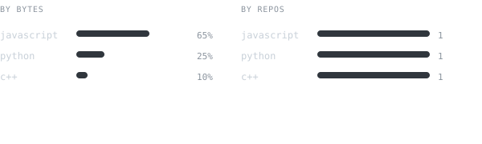

  <picture>
    
  </picture>

 

<picture>
  
</picture>

> Undergraduate engineering student building lightweight tooling, graphics routines, and interactive software.

Exploring low-level systems, computer vision interactions, and terminal automation. 
Focused on tools that feel instant and run with zero external bloat.

 

<picture>
  
</picture>

<samp>python</samp> &nbsp; <samp>c++</samp> &nbsp; <samp>javascript</samp> &nbsp; <samp>react</samp> &nbsp; <samp>linux</samp> &nbsp; <samp>git</samp> &nbsp; <samp>automation</samp>

  

<picture>
  
</picture>

**[PuzzleBooth](https://github.com/KomradeKrusader/PuzzleBooth)** · <samp>javascript</samp>, <samp>computer-vision</samp>  
Interactive camera application that captures real-time video feeds and slices them into interactive tile puzzles.

**[KomradeKrusader](https://github.com/KomradeKrusader/KomradeKrusader)** · <samp>python</samp>, <samp>svg</samp>, <samp>actions</samp>  
Self-generating GitHub profile powered by local ONNX background segmentation, SMIL vector typing, and automated nightly refreshes.

 

<picture>
  
</picture>

<picture>
  
</picture>

 

<picture>
  
</picture>